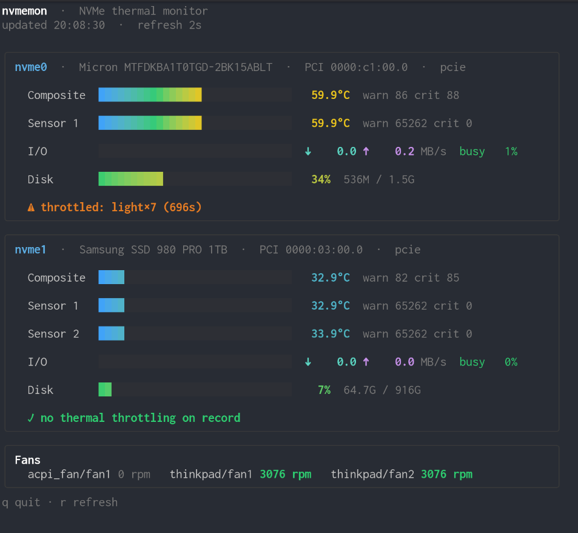

# nvmemon

A terminal NVMe thermal monitor. It lists every attached NVMe drive with
color-gradient temperature bars and cross-references each drive's thermal
throttling counters and the system's fan speeds.

> **Linux only.** nvmemon reads Linux `sysfs` and `nvme-cli`, so it does not
> run on macOS or Windows.

Built with [Bubble Tea v2](https://charm.land/bubbletea/v2) and
[Lip Gloss v2](https://charm.land/lipgloss/v2).

<p align="center">
  
</p>

## Features

- Auto-discovers all NVMe drives from sysfs (`/sys/class/hwmon`).
- Per-sensor temperature bars with a cool→hot color gradient (blue → green →
  yellow → orange → red), scaled so normal operating temps read green/yellow.
- Live **I/O throughput** per drive (read/write MB/s) with a peak-scaled bar,
  plus device **utilization** (% busy time, iostat-style).
- **Capacity used** per drive (aggregated across mounted partitions) with a
  green→red bar.
- Shows each drive's model, PCI address, and transport — handy for telling an
  internal drive apart from a USB4/Thunderbolt-attached one.
- Cross-references thermal throttling from the drive's SMART log
  (`nvme smart-log`): light/heavy throttle transitions, time spent throttled,
  and minutes above the warning/critical thresholds.
- Lists system fan speeds (e.g. ThinkPad fans) alongside the drives.
- Live refresh; press `r` to force a refresh, `q` to quit.

## Install

```sh
go install github.com/rubiojr/nvmemon@latest
```

Or build from source:

```sh
go build -o nvmemon .
```

For release builds, stamp the exact tag into the binary:

```sh
go build -ldflags "-X github.com/rubiojr/nvmemon/internal/version.Version=$(git describe --tags)" -o nvmemon .
```

A plain `go install github.com/rubiojr/nvmemon@latest` already records the
module tag, so `nvmemon --version` reports it without any ldflags.

## Usage

```sh
nvmemon
```

Flags:

| Flag            | Default        | Description                                       |
|-----------------|----------------|---------------------------------------------------|
| `-interval`     | `2s`           | Refresh interval                                  |
| `-sysfs`        | `/sys`         | sysfs mount point                                 |
| `-proc-mounts`  | `/proc/mounts` | Mount table path                                  |
| `-no-throttle`  | `false`        | Skip `nvme smart-log` throttle collection         |
| `-once`         | `false`        | Print a single plain-text reading and exit (no TUI) |
| `-version`      | `false`        | Print version and exit                            |

### Smoke testing / headless use

`-once` collects two samples one `-interval` apart, then prints a plain-text
report (temperatures, throughput, utilization, capacity, throttling) and exits.
It needs no terminal, so it's handy over SSH or for a quick sanity check:

```sh
nvmemon --once
```

### Throughput data needs nvme-cli + root

Temperatures, fan speeds, I/O throughput, utilization, and capacity all come
from sysfs / statfs and need no special privileges. Only the **throttling
counters** come from `nvme smart-log`, which requires
[nvme-cli](https://github.com/linux-nvme/nvme-cli) and usually root:

```sh
sudo nvmemon
```

Without it, temperatures still work and the throttle line shows
"unavailable (needs root + nvme-cli)". Use `-no-throttle` to skip it entirely.

## Development

```sh
go test ./...                                           # run tests
NVMEMON_PREVIEW=1 go test ./internal/ui -run TestPreview -v   # render a sample frame
```
